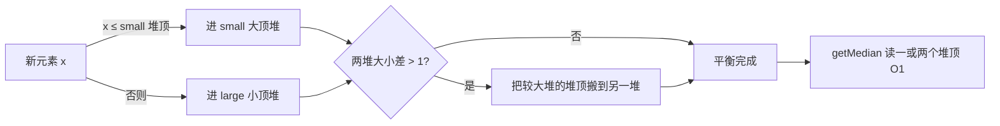

# 堆、对顶堆与有序多重集：一次六维深度解析

> 本文把二叉堆（Binary Heap）、对顶堆（Dual Heap）与有序多重集（TreeMultiset / 平衡树）放进同一条主线里讲透。三者并不是并列的三种技巧，而是同一个问题——
> **动态极值与动态秩序维护**——在能力需求逐级加码时的三级形态。

---

## 一、缘起与直觉

### 1.1 痛点溯源：一份朴素结构的“体检报告”

几乎所有堆的应用都可以还原成同一个问题：数据不断增删，而你反复只问一句话—— **“现在的最值是谁？”** 这类“动态极值维护”需求把朴素结构逼到了墙角。

| 方案            | 插入     | 取最值   | 删除极值 | 致命痛点                         |
|-----------------|----------|----------|----------|----------------------------------|
| 无序数组 / 链表 | O(1)     | O(n)     | O(n)     | 每次找最值都要扫全表             |
| 有序数组        | O(n)     | O(1)     | O(1)     | 插入要搬移大量元素               |
| 每次全排序      | —        | O(1)     | —        | 只要一个堆顶，却付了 O(n log n)  |
| 平衡 BST        | O(log n) | O(log n) | O(log n) | 能做，但常数大、缓存差、实现复杂 |

核心矛盾一句话： **有序保证查询快但维护代价高，无序维护便宜但查询慢。** 堆的历史必然性正来自对这个矛盾的釜底抽薪——
**既然业务只关心极值，就完全没有必要维护所有元素之间的完整顺序。**

### 1.2 心智钩子：一支只露出队首的队伍

> **堆像一支只露出最优候选人的队伍——它不关心所有人怎么排，只保证下一位该出场的人永远站在门口。**

看到“优先级”“第 K 大”“中位数 + 动态增删”，就应该条件反射地想到堆家族。这是唤醒本结构的心智钩子。

### 1.3 物理映射与信息论：少维护的信息就是省下的时间

堆用三根支柱把上面的直觉落地：

1. **完全二叉树**：除最后一层外每层填满，最后一层靠左连续——没有空洞，因此可以无指针压进连续数组。
2. **数组映射**：树的父子关系完全由下标算术隐式表达，省掉 `left / right / parent` 三个指针。
3. **父子偏序（堆序性质）**：只约束父子、不约束兄弟与跨子树，即“局部有序、全局无序”，唯一的强保证是 **根节点必为全局极值**。

从信息论看这笔账会更清晰。维护 `n` 个元素的完整顺序，需要区分 `n!` 种排列，信息量约 `log(n!) ≈ n log n`
比特；而堆只维护父子偏序，主动放弃了“第二小在哪里”“兄弟谁大谁小”“遍历是否有序”这些信息。
**被省下的那部分信息量，直接变成了省下的操作时间。这就是堆效率的数学根源。**

### 1.4 当堆不够用：对顶堆与有序多重集登场

堆的短板恰恰藏在它的优点里—— **单堆只有一个方向**。

- **对顶堆**补齐“正中间”的能力。中位数既不是最大值也不是最小值，单堆无从下手。对顶堆用一个大顶堆装较小的一半、一个小顶堆装较大的一半，两个堆顶共同夹出一条
  **会移动的动态分界线**。触发信号是：数据流式增删、查询顺序统计量（中位数 / 第 K 小 / 分位数）、且只关心分界点附近的秩序。
- **有序多重集**（`TreeMultiset`，Java 常用 `TreeMap<key, count>` 实现）补齐三项堆做不到的能力： **双端极值**、 **floor /
  ceiling 邻近查询**、 **频繁且实时的任意随机删除**（最坏 O (log n)，而非懒删除的均摊）。

一张“信号雷达”可以把选择固化成直觉：

- 反复取当前最值 → `BinaryHeap`
- 第 K 大 / Top K → 定容堆 `TopKHeap`
- 动态中位数 / 第 k 小 → 对顶堆
- 滑动窗口且要删堆中间元素 → 懒删除堆
- 双端极值 / floor / ceiling / 严格实时删除 → `TreeMultiset`
- 贪心时需要“反悔” → 反悔堆

---

## 二、结构解剖与动态演变

### 2.1 核心 API 与时空矩阵

**二叉堆**

| 操作             | 复杂度   | 说明                                |
|------------------|----------|-------------------------------------|
| `peek()` 看堆顶  | O(1)     | 极值恒在根，直接读数组首元素        |
| `push()` 插入    | O(log n) | 末尾插入 + 上浮；均摊扩容 O(1)      |
| `pop()` 弹顶     | O(log n) | 末尾补顶 + 下沉                     |
| `heapify()` 建堆 | **O(n)** | Floyd 自底向上，**不是** O(n log n) |
| 查找任意元素     | O(n)     | 不保证全序，只能线性扫              |
| 删除任意元素     | O(n)     | O(n) 定位 + O(log n) 局部修复       |

**对顶堆**：插入 O (log n)（只搬一个堆顶再平衡），`getMedian()` O (1)。

**有序多重集**：`add / remove`、`first / last`、`floor / ceiling` 全部 O (log n)，内存与有效 key 数严格同步。

### 2.2 结构不变量：维持合法性的绝对法则

- **二叉堆**：①形状不变量——逻辑结构永远是完全二叉树；②顺序不变量——任意父节点优先级不晚于子节点；③边界不变量——有效元素只位于
  `[0, size)`。
- **对顶堆**：①顺序不变量——`small`（大顶堆）中任意有效元素 ≤ `large`（小顶堆）中任意有效元素；②大小不变量——中位数场景保持
  `small.size == large.size` 或 `small.size == large.size + 1`；③计数不变量——逻辑 `size` 只统计有效元素，不含尚未物理弹出的墓碑。
- **懒删除堆**：`frequency[x]` 记有效数量、`delayed[x]` 记待物理弹出的墓碑数量、`size = Σ frequency[x]`。铁律是 **
  `peek / pop` 前必须先清理堆顶**，否则堆顶可能是已删除元素。
- **有序多重集**：`counts[key] > 0`（计数归零必须删 key）、`size == Σ counts[key]`、红黑树不变量保证树高 O (log n)。

### 2.3 下标映射公式

```text
0-indexed（数组堆通用）
parent(i) = (i - 1) / 2      // 整数除法自动向下取整
left(i)   = 2 * i + 1
right(i)  = 2 * i + 2

1-indexed（手写 MaxHeap 更对称）
parent(i) = i / 2
left(i)   = 2 * i            // 位运算 i << 1
right(i)  = 2 * i + 1

树高 h = ⌊log₂ n⌋            // 所有堆操作复杂度的命门
```

推导要点：第 `d` 层（根为第 0 层）恰有 `2^d` 个节点，占下标区间 `[2^d − 1, 2^(d+1) − 2]`。设节点 `i` 是第 `d` 层从左第 `p`
个，则 `i = (2^d − 1) + p`，其左孩子 `= 2(2^d − 1 + p) + 1 = 2i + 1`，右孩子 `= 2i + 2`，父节点反解取整即可。

### 2.4 动态可视化：上浮、下沉与再平衡

**插入时的上浮（siftUp）**——最小堆 `[2,5,8,9,7]` 插入 `1`：

```text
末尾追加:  [2, 5, 8, 9, 7, 1]              1 在下标 5，parent=(5-1)/2=2 → 值 8
1 < 8 交换: [2, 5, 1, 9, 7, 8]              1 到下标 2，parent=(2-1)/2=0 → 值 2
1 < 2 交换: [1, 5, 2, 9, 7, 8]              1 到根，停止
```

只修复“自己到根”的一条祖先链，最多走 `⌊log₂ n⌋` 步。

**弹顶时的下沉（siftDown）**：把末尾元素补到根，再沿“与更优子节点比较并交换”的路径一路下沉，同样只走一条路径。

**对顶堆的再平衡**——有效序列 `1 3 5 | 7 9`，此时 `small = [5,1,3]`（大顶堆顶 5）、`large = [7,9]`（小顶堆顶 7）：

```text
插入 11:  11 ≥ 大顶堆顶 5 → 进 large        large = [7,9,11]
检查平衡:  若 large 比 small 多超过 1 个
          → 仅把 large 堆顶搬到 small       只移动一个堆顶，O(log n)
```

关键在于： **再平衡永远只搬一个堆顶，绝不重排全部元素。**



---

## 三、工业级编码与防御

### 3.1 核心引擎：下沉（siftDown）

```java
/**
 * 下沉：让 parentIndex 处元素与"更优的子节点"比较并交换，直到恢复堆序。
 * 每轮都要在左右孩子中先挑出更优者，否则可能把更差的换上来，破坏不变量。
 */
private void siftDown(int parentIndex) {
  while (2 * parentIndex + 1 < size) {              // 至少有左孩子才继续
    int betterChildIndex = 2 * parentIndex + 1;
    int rightChildIndex = betterChildIndex + 1;
    if (rightChildIndex < size
        && comparator.compare(elementAt(rightChildIndex), elementAt(betterChildIndex)) < 0) {
      betterChildIndex = rightChildIndex;           // 右孩子更优则改选右孩子
    }
    if (comparator.compare(elementAt(parentIndex), elementAt(betterChildIndex)) <= 0) {
      break;                                        // 父已不劣于更优子，堆序恢复
    }
    swap(parentIndex, betterChildIndex);
    parentIndex = betterChildIndex;                 // 继续沿这条路径下沉
  }
}
```

配合上浮，一套引擎靠比较器即可双向复用：

```java
new BinaryHeap<>(Comparator.naturalOrder());  // 小根堆，堆顶最小
new BinaryHeap<>(Comparator.reverseOrder());  // 大根堆，堆顶最大
```

### 3.2 核心引擎：懒删除堆

```java
/** 逻辑删除：不动堆结构，只打标记，把 O(n) 的随机删除推迟为将来的堆顶删除。 */
public boolean remove(E element) {
    Integer validCount = frequency.get(element);
    if (validCount == null) {
        return false;                          // 本就不存在，删除失败
    }
    decrease(frequency, element, validCount); // 有效计数 -1（归零则移除 key）
    delayed.merge(element, 1, Integer::sum);  // 墓碑计数 +1
    size--;                                   // 逻辑大小 -1
    cleanTop();                               // 顺手清理堆顶墓碑
    return true;
}

/** 取值前的必修课：把堆顶的墓碑物理弹出，保证 peek/pop 拿到的一定是有效元素。 */
private void cleanTop() {
    while (!priorityQueue.isEmpty()) {
        E top = priorityQueue.peek();
        Integer delayedCount = delayed.get(top);
        if (delayedCount == null) {
            return;                               // 堆顶有效，停止清理
        }
        priorityQueue.poll();                   // 堆顶是墓碑，物理弹出
        if (delayedCount == 1) {
            delayed.remove(top);
        } else {
            delayed.put(top, delayedCount - 1);
        }
    }
}
```

### 3.3 三个最阴险的死亡测试

**死亡测试 ①：比较器整数溢出。** 写 `(a, b) -> a - b`，当 `a = Integer.MAX_VALUE`、`b = -1` 时相减溢出，比较结果反向，堆序不变量瞬间被破坏。防御：一律用
`Integer::compare`。JDK 要求比较器满足反对称性、传递性、一致性，违反约束容器不会替业务纠错。

**死亡测试 ②：重复值跨分区删除。** 输入 `add: 2,2,2,3` 后 `remove: 2,2,2`。若只用 `Set` 标记删除，三个 `2`
会被压成一个标记；若仅凭当前分界判断元素属于哪个堆，当重复值分散在两侧时会删错计数。防御：删除表必须是 `Map<E, Integer>` 而非
`Set<E>`，每次只减少一个有效计数，重平衡只信任已清理过的堆顶。

**死亡测试 ③：墓碑堆积与并发访问。** 长滑动窗口里被删元素长期浮不到堆顶，物理堆会显著大于逻辑窗口——懒删除保证的是
**时间均摊，而非物理容量等于有效元素数**。防御：内存敏感或删除频繁时改用 `TreeMultiset`；长生命周期服务设“物理 /
逻辑大小”阈值周期性重建；教学模板与 JDK `PriorityQueue` 均 **非线程安全**，并发场景需外部加锁或改用
`PriorityBlockingQueue`。

其他工业防线：`Objects.requireNonNull` 尽早暴露空比较器；弹出后清空数组槽位以便 GC 回收；`clear()`
同时清空堆、有效计数与墓碑避免状态撕裂；生产版应补容量溢出检查，尽早抛 `OutOfMemoryError`。

---

## 四、本质与权衡

### 4.1 O (n) 建堆：为什么不是 O (n log n)

自底向上建堆的精髓在于： **下沉代价与节点高度成正比，而越靠近叶子的节点越多、能下沉的高度越低。** 把工作量按高度加权求和：

```text
总工作量 = Σ (某高度的节点数 × 该高度)
        = Σ_{k=0}^{log n} (n / 2^(k+1)) · O(k)
        = (n/2) · Σ k / 2^k  ≤  (n/2) · Σ_{k=0}^{∞} k / 2^k
```

关键在于无穷级数 `Σ k / 2^k = 2` 收敛为常数，于是 `T(n) = O(n)`。直觉版本：一半节点是叶子（下沉 0
层），四分之一最多下沉一层……越贵的操作对应的节点越稀少，加权之后被压到线性。相比之下“逐个插入建堆”是 O (n log n)
，因为它没利用这个高度分布。

### 4.2 硬件亲和性：数组连续性带来的缓存红利

- **无指针追逐**：父子跳转是整数算术，不必解引用去内存里“追”下一个节点。
- **缓存行友好**：数组连续存放，相邻元素大概率落在同一条 CPU Cache Line；自底向上建堆的访问模式高度可预测，硬件预取器工作良好。
- **GC 压力低**：堆节点没有对象包装字段，而红黑树节点要背 `key / value / left / right / parent / color`
  六个字段，地址四散，每次搜索或旋转都跨越多个内存位置，分支预测与缓存局部性都更差。

一个必须澄清的细节：Java `Object[]` 连续存放的只是 **对象引用**，对象本体仍散落在堆内存。若元素是整数且性能极端敏感，`int[]`
特化堆会远快于 `BinaryHeap<Integer>`，因为它避免了装箱和二次间接寻址。结论是——
**在“高频取极值”场景下，即便渐进复杂度相同，堆的实测性能通常显著优于平衡树。**

### 4.3 空间与时间的博弈

| 结构 / 变体    | 付出的空间                                   | 换来的能力                             |
|----------------|----------------------------------------------|----------------------------------------|
| `BinaryHeap`   | 动态数组预留容量（翻倍扩容，峰值近一倍空槽） | O(1) 看顶、O(log n) 增删顶             |
| `TopKHeap`     | 只保留 k 个元素                              | 全排序 O(n log n) 降为 **O(n log k)**  |
| 对顶堆         | 两个堆                                       | 用两端极值描述动态中位数               |
| 懒删除堆       | `frequency` + `delayed` 双计数 + 墓碑        | 避开堆中间的 O(n) 定位删除             |
| `TreeMultiset` | 红黑树节点 + 计数                            | 最坏 O(log n) 实时删除、双端与邻近查询 |

一个能力边界要记牢：普通 `TreeMap` 只按 key 导航， **不保存子树元素数量**，无法直接按排名取第 k 个。若要单树完成 `kth`
，需给节点增设“子树大小”字段，升级成 **顺序统计树（Order-Statistic Tree）**。

---

## 五、工业落地与实战

### 5.1 真实世界架构

- **JDK `PriorityQueue`**：数组实现的二叉最小堆，比较器控制优先级，插入 / 弹顶 O (log n)，是 `BinaryHeap` 最直接的工业参照。
- **JDK `ScheduledThreadPoolExecutor`**：内部延迟队列按任务触发时间维护最小值，只关心“下一个到期任务”，堆天然比有序数组合适。
- **Kubernetes Scheduler**：调度队列优先处理更紧急、更高优先级的 Pod，堆负责核心的动态优先级选择。
- **图算法与检索系统**：Dijkstra、Prim、A*、多路归并反复“取当前代价最小状态”，堆把每轮的全局扫描从 O (n) 降到 O (log n)
  ，是稀疏图算法工程可用复杂度的关键部件。
- **数据库 Top N**：`ORDER BY ... LIMIT k` 无需全排序，固定容量堆把排序阶段从 O (n log n) 降到 O (n log k)。

### 5.2 力扣试金石

**数据流的中位数（LeetCode 295）——对顶堆的教科书。** `small` 大顶堆装较小一半，`large` 小顶堆装较大一半，维持 `small` 与
`large` 等大或多一个；奇数取 `small` 堆顶，偶数取两堆顶均值。插入 O (log n)，查询 O (1)。这道题非对顶堆不能优雅解。

**前 K 个高频元素（LeetCode 347）——定容堆过滤器。** 先用哈希统计频次，再以频次为键维护一个大小恒为 k 的小根堆，把 `n − k`
个不可能进答案的元素 O (1) 挤掉，复杂度 O (n log k)，堆顶始终是“保留集合里最差的一个”。

**合并 K 个升序链表（LeetCode 23）——K 路归并的活跃前沿。** 把每条链表的当前头节点入堆，弹出全局最小再补它的后继，弹一入一，堆中最多
k 个节点，总复杂度 O (N log k)。

**课程表 III（LeetCode 630）——反悔贪心的样板。**
按截止时间排序后“先修再说”，把已选课程时长压入大顶堆；一旦累计时间超过当前截止时间，就弹出耗时最长的那门反悔替换。堆维护的不是“下一步选谁”，而是“过去最该撤销谁”。

---

## 六、融会贯通与差异剖析

### 6.1 三类结构横向对比

| 维度            | 二叉堆 / 对顶堆             | `TreeMultiset`（红黑树）             |
|-----------------|-----------------------------|--------------------------------------|
| 底层建模        | 完全二叉树 + 父子偏序       | 红黑树 + 全局键有序                  |
| 物理布局        | 连续数组引用                | 分散树节点                           |
| 看单端极值      | **O(1)**                    | O(log n)                             |
| 插入            | O(log n)                    | O(log n)                             |
| 任意删除        | 原生 O(n)，懒删除均摊优化   | **最坏 O(log n) 实时删除**           |
| 双端极值        | 通常需两个堆                | **单结构支持**                       |
| floor / ceiling | 不支持                      | O(log n) 支持                        |
| 重复值          | 可直接入堆，懒删除需计数    | `key → count`                        |
| 常数 / 缓存     | **通常更优**                | 通常更差（指针追逐）                 |
| 内存上界        | 懒删除可能滞留墓碑          | 与有效 key 数严格同步                |
| 最适场景        | 高频单端极值、Top K、中位数 | 范围 / 邻近 / 双端查询、频繁随机删除 |

### 6.2 一句话定位三种建模

- **二叉堆**：一个方向的偏序，回答“下一位极值是谁”——单端极值、Top K、调度。
- **对顶堆**：两个方向相反的堆维护一条移动的分界线，回答“分界点附近的秩序”——动态中位数、第 k 小。
- **有序多重集**：全局键有序，回答“任意位置的邻近、双端、实时删除”。

### 6.3 选择决策树

```text
只取一个方向的最值？              → BinaryHeap
只保留最优 k 个 / 求第 K 值？      → 定容堆 TopKHeap
需要动态中位数 / 第 k 小？
  ├─ 删除少或可懒删除             → 对顶堆
  └─ 删除频繁且内存上界敏感       → 两个 TreeMultiset 维护分界
需要 floor / ceiling / 双端极值？  → TreeMultiset
只查存在性，不问顺序？            → 哈希表
```

### 6.4 记忆锚点

> **堆像一支只露出最优候选人的队伍——它不关心所有人怎么排，只保证下一位该出场的人永远站在门口。**

对顶堆是把两支这样的队伍背靠背站好，中间夹出的缝隙就是中位数；有序多重集则是让整支队伍随时可以从任意位置插入、抽走、并向左右张望。

### 6.5 哲理总结

> **高效数据结构的本质，不是保存更多秩序，而是准确判断——哪些秩序根本不值得维护。**

二叉堆用堆序性质换来极值 O (log n)，用数组映射换来缓存友好与低 GC，用懒删除换来实现简洁；对顶堆用两条局部极值描述一条动态分界线，而非维护完整排名。它们共享同一条底层逻辑：
**不多做一分不必要的维护。** 从单堆取单极值，到定容堆过滤 Top
K，再到双堆维护动态秩序，最后到索引堆、平衡树支持任意元素高效修改——每补齐一项能力，代价永远是更多空间或更大常数。这，就是数据结构世界里最朴素也最深刻的守恒律。
